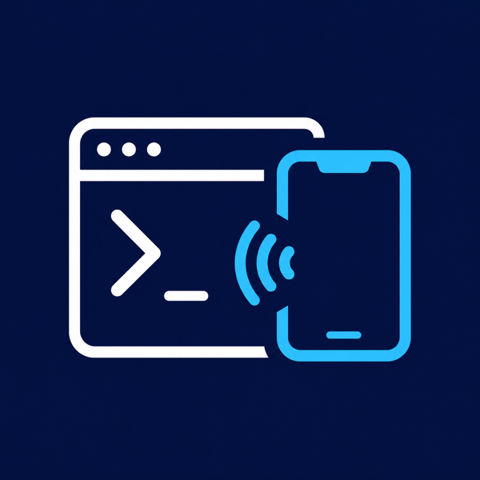

<div align="center">



# Serve Sim

Mirror iOS Simulator inside VS Code and Cursor. Powered by [`serve-sim`](https://github.com/EvanBacon/serve-sim)

</div>

> [!NOTE]
> This extension is a thin editor wrapper around the [`serve-sim`](https://github.com/EvanBacon/serve-sim) CLI. It does not bundle the simulator bridge or native helpers. It finds or downloads the CLI, starts the local preview server, and embeds that preview in an editor webview.

## Overview

Serve Sim keeps the simulator preview next to your code. Open the panel, pick an installed iOS Simulator if needed, and the extension boots or mirrors the selected device through `serve-sim`.

The extension focuses on the local desktop workflow:

- Reusable preview panel for VS Code and Cursor.
- Installed iOS Simulator picker when no device is booted.
- Boot, wait, mirror, restart, and stop controls from the panel.
- CLI resolution through `serveSim.executablePath`, workspace `node_modules/.bin`, PATH, then `npx -y serve-sim@latest`.
- Clear recovery UI when the preview is not ready or no booted simulator is available.

## Requirements

- macOS
- Xcode with iOS Simulator
- Node.js 20+
- `npx` on PATH when using the package fallback

## Commands

- `Serve Sim: Open Panel`
- `Serve Sim: Start`
- `Serve Sim: Restart`
- `Serve Sim: Stop Active Stream`
- `Serve Sim: Stop All Streams`

## Settings

- `serveSim.executablePath`: explicit path to the `serve-sim` CLI.
- `serveSim.port`: starting port. Default: `3200`.
- `serveSim.packageSpec`: package used by `npx`. Default: `serve-sim@latest`.
- `serveSim.autoOpenPanel`: open the panel after start. Default: `true`.
- `serveSim.codec`: `auto`, `h264`, or `mjpeg`. Default: `auto`.

## Development

```sh
pnpm install
pnpm test
pnpm build
pnpm package
```

Run the extension with the `Run Extension` launch config.

## License

Apache-2.0
